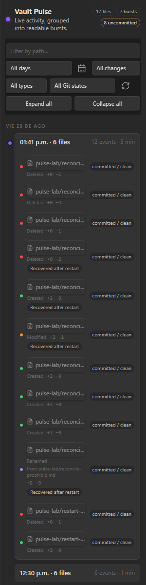
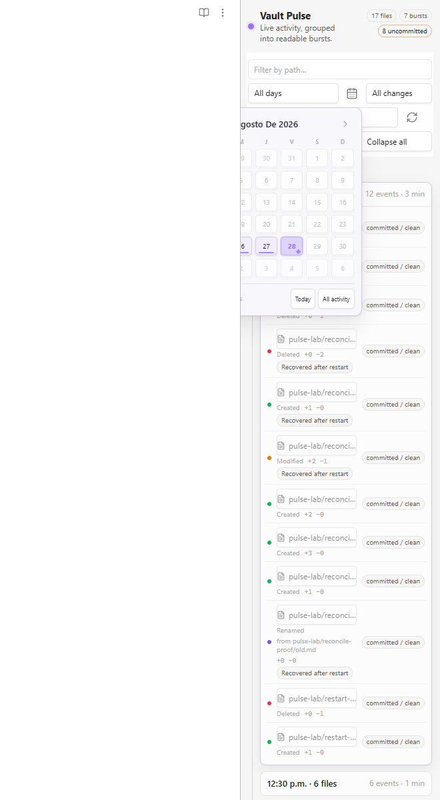

# Vault Pulse

Visualize activity across an Obsidian vault as a compact, burst-based timeline.

[](https://github.com/AlekZen/vault-pulse/releases)
[](LICENSE)

Vault Pulse records file activity locally, reconciles changes made while Obsidian was closed, and groups noisy editing sessions into readable bursts. It is designed for large vaults where a flat list of recent Markdown notes is not enough.

> Vault Pulse 0.1.0 is desktop-only. Its optional Git overlay invokes the local Git executable through a Node.js API.

## Screenshots

### Dark theme



### Light theme



## Features

- Tracks file creation, modification, rename, deletion, and startup reconciliation.
- Covers every vault file; configured text formats additionally receive line-change statistics.
- Groups nearby events into collapsible activity bursts.
- Filters by path, day, operation, extension, and Git state.
- Includes a six-week activity calendar with accessible keyboard navigation.
- Restores changes made while Obsidian was closed from a bounded local baseline.
- Coordinates multiple Obsidian instances with a writer lock so only one instance records.
- Optionally displays read-only Git status and the latest commit without changing the repository.
- Uses no network services, telemetry, accounts, or advertising.

## Requirements

- Obsidian 1.5.0 or later.
- Windows, macOS, or Linux desktop.
- Git on `PATH` only if the Git overlay is enabled.

## Installation

### Community Plugins

After the initial Community directory review is approved:

1. Open **Settings → Community plugins** in Obsidian.
2. Select **Browse** and search for **Vault Pulse**.
3. Select **Install**, then **Enable**.

### Manual installation

1. Download `main.js`, `manifest.json`, and `styles.css` from the [latest GitHub release](https://github.com/AlekZen/vault-pulse/releases/latest).
2. Create `<vault>/.obsidian/plugins/vault-pulse/`.
3. Copy the three files into that folder.
4. Reload Obsidian, then enable **Vault Pulse** under **Community plugins**.

## Usage

Open Vault Pulse from the ribbon activity icon or run **Vault Pulse: Open activity timeline** from the command palette.

The timeline updates while Obsidian is open. At startup, Vault Pulse compares the current vault with its previous baseline and records changes made by sync tools, command-line programs, or other applications while Obsidian was closed.

### Calendar keyboard controls

When the activity calendar is open:

| Key | Action |
|---|---|
| `ArrowLeft` / `ArrowRight` | Previous or next day |
| `ArrowUp` / `ArrowDown` | Previous or next week |
| `Home` / `End` | Monday or Sunday of the current week |
| `PageUp` / `PageDown` | Previous or next month |
| `Shift+PageUp` / `Shift+PageDown` | Previous or next year |
| `Enter` / `Space` | Select the focused day |
| `Escape` | Close the calendar and return focus to its button |

## Git overlay

The Git overlay is enabled by default on desktop and is strictly read-only. Vault Pulse allows only these commands:

- `git status`
- `git rev-parse`
- `git log`
- `git diff-tree`

It sets `GIT_OPTIONAL_LOCKS=0`, applies time and output limits, and never stages, commits, resets, checks out, or writes repository data. Disable the overlay in Vault Pulse settings if it is not needed.

## Settings

| Setting | Default | Description |
|---|---:|---|
| Tracked text extensions | Common note, data, code, and web formats | Formats that receive line-change statistics |
| Exclude globs | Empty | Additional paths to ignore; the vault configuration folder is always excluded |
| Large file threshold | 512 KB | Larger text files are tracked without line statistics |
| Baseline content budget | 20 MB | Maximum retained text used for reconciliation and diffs |
| Retention | 90 days / 50,000 events | Bounds the local activity log |
| Baseline flush interval | 300 seconds | Frequency of durable baseline snapshots |
| Burst window | 10 minutes | Maximum gap between events in one burst |
| Git overlay | Enabled | Shows read-only repository status |
| Git refresh interval | 5 seconds | Frequency of Git status refreshes |

## Local data and privacy

Vault Pulse does not make network requests and does not collect telemetry. Runtime data stays under the plugin directory inside the vault configuration folder:

- `activity.jsonl` — bounded activity log.
- `baseline.gz` — compressed reconciliation baseline.
- `writer.lock` — multi-instance writer coordination.
- `data.json` — Obsidian-managed plugin settings and local state.

The optional Git overlay starts the local `git` executable and reads repository metadata. It does not send that information anywhere.

## Development

```bash
npm ci
npm test
npm run build
```

The production build writes `main.js` at the repository root. A release must attach `main.js`, `manifest.json`, and `styles.css`, and its tag must match `manifest.json`.

## Origin and license

Vault Pulse began as a derivative of [Vault Change Feed](https://github.com/kains2866/vault-change-feed) by tiyukains. The product, interface, and storage contract have since diverged substantially. The original author and copyright remain credited in [LICENSE](LICENSE).

Vault Pulse is distributed under the MIT License.